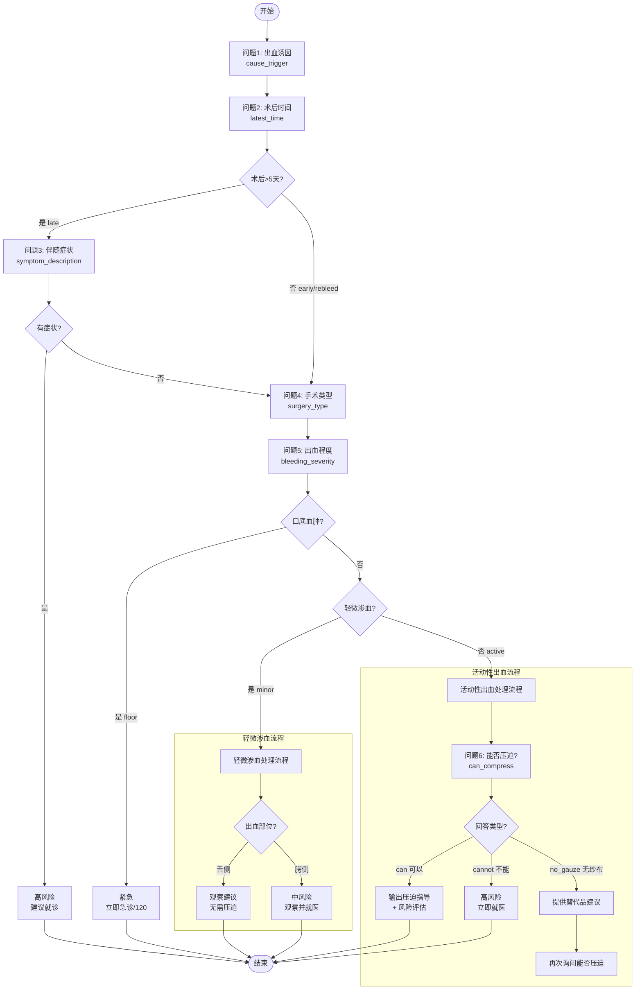

# Mouth Cavity Graph 槽位收集流程文档

> 文档更新日期: 2025-12-25

## 1. 概述

`MouthCavityKnowledge` 是一个基于 LangGraph 实现的口腔术后出血分诊系统。它通过逐步收集用户信息（槽位/Slots）来评估出血风险并提供针对性的护理建议。

## 2. 槽位定义

系统定义了以下核心槽位（位于 `MouthCavityState` TypedDict）：

| 槽位名称 | 类型 | 说明 | 问题顺序 |
|---------|------|------|---------|
| `cause_trigger` | str | 出血诱因 | 问题1 |
| `latest_time` | str | 术后时间/分期 | 问题2 |
| `symptom_description` | str | 伴随症状（仅术后>5天询问） | 问题3 |
| `surgery_type` | str | 手术类型 | 问题4 |
| `bleeding_severity` | str | 出血严重程度 | 问题5 |
| `can_compress` | str | 是否能够压迫止血 | 问题6 |
| `bleeding_location` | str | 出血部位（舌侧/腭侧） | 条件性询问 |
| `rebleed_after_compression` | str | 压迫后是否再次出血 | 条件性询问 |

每个槽位都有对应的 `_raw` 字段存储用户原始输入。

## 3. 槽位收集流程图



## 4. 核心函数说明

### 4.1 槽位提取 `_extract_slots()`

**位置**: `mouth_cavity_graph.py:632-672`

**职责**: 从对话历史中提取已收集的槽位值

**工作原理**:
1. 遍历消息列表
2. 对于 `AIMessage`：调用 `_identify_slot_from_question()` 识别当前正在询问的槽位
3. 对于 `HumanMessage`：调用 `_parse_slot_value()` 解析用户回答

**特殊处理**:
- `can_compress` 槽位允许在值为 `no_gauze` 时重新更新（因为系统会提供替代品建议后再次询问）
- 解析结果中的 `debug_info` 会被单独存储到 `{slot_name}_debug_info`

### 4.2 问题识别 `_identify_slot_from_question()`

**位置**: `mouth_cavity_graph.py:674-703`

**识别规则**:

| 槽位 | 识别条件 |
|------|---------|
| `cause_trigger` | 包含"问题1" 或 (诱因 + 咬硬物/漱口/缝线) |
| `latest_time` | 包含"问题2" 或 术后多久/手术后 |
| `symptom_description` | 包含"问题3" 或 (伴随 + 疼痛/发热) |
| `surgery_type` | 包含"问题4" 或 什么手术 |
| `bleeding_location` | 包含"手术区域" 或 (舌侧 + 腭侧) |
| `bleeding_severity` | 包含"问题5/7" 或 (出血表现 + 轻微渗血) |
| `can_compress` | 包含"问题6" 或 是否能够使用干净纱布/替代品后/能够进行压迫止血 |
| `rebleed_after_compression` | 包含 是否仍然持续或再次出血 / (压迫 + 再次出血/仍然) / 出血是否止住 |

### 4.3 决策下一步 `_decide_next_step()`

**位置**: `mouth_cavity_graph.py:782-1102`

**决策种类 (decision.kind)**:
- `ask`: 需要继续询问用户
- `guidance_followup`: 输出指导信息后继续询问
- `final_response`: 输出最终评估结果
- `followup_rag`: 进入知识库 RAG 跟进模式
- `followup_light`: 轻量应答模式

## 5. 槽位解析函数详解

### 5.1 时间分期解析 `_parse_latest_time()`

**位置**: `mouth_cavity_graph.py:1190-1304`

**返回值**:
| 值 | 含义 | 时间范围 |
|----|------|---------|
| `early` | 术后持续出血期 | <24小时 |
| `rebleed` | 术后再次出血期 | 24小时~5天 |
| `late` | 术后晚期再出血 | >5天 |

**解析优先级**:
1. 关键词匹配 (`刚`/`今天` → early, `一周`/`六天` → late)
2. 数字解析 (小时数/天数映射)
3. 边界判断 (1-5天→rebleed, >5天→late)

### 5.2 手术类型解析 `_parse_surgery_type()`

**位置**: `mouth_cavity_graph.py:1306-1386`

**高风险(涉血管)术式**:
- 上颌窦外提升植骨术
- 上颌窦内提升植骨术
- 软组织移植术
- 块状骨移植术
- 骨柱植骨术
- 引导骨再生技术
- 上颌/下颌无牙颌种植术

**返回值**:
- `vascular`: 涉血管手术（高风险）
- `non_vascular`: 非涉血管手术（常规风险）

**解析流程**:
1. 尝试提取选项 Key (A-Q)
2. 若无 Key，尝试名称匹配
3. 兜底：关键词分析

### 5.3 出血程度解析 `_parse_bleeding_severity()`

**位置**: `mouth_cavity_graph.py:1421-1473`

**返回值**:
| 值 | 含义 | 关键词示例 |
|----|------|-----------|
| `minor` | 轻微渗血 | 轻微/渗血/少量/血丝 |
| `active` | 活动性出血 | 鲜红/大量/止不住/持续 |
| `floor` | 口底血肿(紧急) | 口底/舌根抬高/呼吸困难 |

### 5.4 压迫能力解析 `_parse_can_compress()`

**位置**: `mouth_cavity_graph.py:1594-1676`

**返回值**:
| 值 | 含义 | 关键词示例 |
|----|------|-----------|
| `can` | 可以压迫 | 可以/能/好的/我试试 |
| `cannot` | 无法压迫 | 压不住/没法压/位置太深 |
| `no_gauze` | 没有纱布 | 没有纱布/找不到纱布/用什么替代 |

**特殊处理**:
- 当返回 `no_gauze` 时，系统会：
  1. 输出纱布替代品建议（干净毛巾、洗脸巾等）
  2. 重新询问是否能够进行压迫止血
  3. 允许 `can_compress` 槽位被更新

### 5.5 再次出血解析 `_parse_rebleed()`

**位置**: `mouth_cavity_graph.py:1475-1514`

**返回值**:
| 值 | 含义 | 关键词示例 |
|----|------|-----------|
| `resolved` | 已止血 | 不再出血/止住了/好了 |
| `again` | 再次出血 | 还是/又出血/没止住/持续 |

## 6. 风险评估逻辑

### 6.1 风险等级定义

```python
class RiskLevel(Enum):
    NONE = "none"      # 无风险，正常观察
    LOW = "low"        # 低风险，继续观察
    MEDIUM = "medium"  # 中风险，建议就诊
    HIGH = "high"      # 高风险，紧急就医/120
```

### 6.2 风险评估矩阵

| 条件组合 | 风险等级 | 建议 |
|---------|---------|------|
| 口底血肿 | HIGH | 立即急诊或120 |
| 无法压迫 | HIGH | 尽快就医 |
| 涉血管术式 + 再次出血 | HIGH | 紧急就医 |
| 术后>5天 + 有全身症状 | MEDIUM | 尽快就诊 |
| 涉血管术式 + 术后5天内 | MEDIUM | 建议就诊 |
| 非涉血管 + 再次出血 | MEDIUM | 尽快就医 |
| 轻微渗血 + 术后<24h | NONE | 正常现象，观察 |
| 轻微渗血 + 术后24h~5天 | LOW | 观察，避免诱因 |
| 活动性出血 + 可压迫 + 止住 | LOW | 继续观察 |

### 6.3 基于出血部位的风险评估 `_assess_risk_by_location()`

**位置**: `mouth_cavity_graph.py:2031-2109`

该函数综合考虑出血部位、时间分期、出血程度、压迫后状态等因素进行风险评估：

**舌侧 (lingual) 评估逻辑**:

| 时间分期 | 出血程度 | 压迫后状态 | 风险等级 | 护理方案ID |
|---------|---------|-----------|---------|-----------|
| early/rebleed | minor | - | NONE | lingual_minor_early |
| early/rebleed | minor | resolved | LOW | lingual_minor_resolved |
| early/rebleed | minor | again | MEDIUM | lingual_minor_rebleed |
| early/rebleed | active | - | MEDIUM | lingual_active_early |
| early/rebleed | active | resolved | LOW | lingual_minor_resolved |
| early/rebleed | active | again | MEDIUM | active_bleed_standard |
| late | - | resolved | LOW | lingual_late_resolved |
| late | - | again | MEDIUM | lingual_late_rebleed |

**腭侧 (palatal) 评估逻辑**:

| 时间分期 | 出血程度 | 压迫后状态 | 风险等级 | 护理方案ID |
|---------|---------|-----------|---------|-----------|
| early/rebleed | minor | - | MEDIUM | palatal_minor_early |
| early/rebleed | minor | resolved | MEDIUM | palatal_compressed_resolved |
| early/rebleed | minor | again | MEDIUM | palatal_compressed_rebleed |
| early/rebleed | active | - | MEDIUM | palatal_compressed_rebleed |
| early/rebleed | active | resolved | MEDIUM | palatal_compressed_resolved |
| early/rebleed | active | again | **HIGH** | palatal_compressed_rebleed |
| late | - | - | MEDIUM | palatal_late |
| - | - | cannot | **HIGH** | palatal_cannot_compress |

**注意**: 腭侧出血整体风险高于舌侧，即使是轻微渗血也至少是 MEDIUM 风险。

## 7. 特殊分支流程

### 7.1 出血部位分支（舌侧 vs 腭侧）

当用户选择软组织移植术时，可能会触发出血部位询问：

**舌侧 (lingual)**:
- 风险相对较低
- 容易压迫
- 轻微渗血时无需压迫，直接观察

**腭侧 (palatal)**:
- 风险相对较高
- 可能涉及重要血管
- 即使轻微渗血也需要密切关注

### 7.2 纱布替代品流程

当用户表示"没有纱布"时：
1. 系统输出替代品建议（来自 `mouth_cavity_logic.yaml` → `gauze_alternative`）
2. 再次询问"使用上述替代品后，是否能够进行压迫止血？"
3. `can_compress` 槽位允许从 `no_gauze` 更新为 `can` 或 `cannot`

## 8. 配置文件说明

### 8.1 `mouth_cavity_logic.yaml` 结构

```yaml
stage_rules:        # 时间分期规则
symptom_profiles:   # 症状描述模板
bleeding_triggers:  # 出血诱因定义
  local:            # 局部诱因
  systemic:         # 全身诱因
care_templates:     # 护理模板
  fragments:        # 可复用片段
    avoid_triggers: ...
    compress_instructions: ...
    gauze_alternative: ...
  plans:            # 完整护理方案
    mild_oze_early: ...
    active_bleed_early: ...
bleeding_locations: # 出血部位定义
humanistic_care:    # 人文关怀话术
```

## 9. 调试模式

启用 `debug_mode=True` 时：
- 问题会带前缀（如 "问题1："）
- 槽位收集完成时会打印详细日志
- 手术类型解析会返回 `debug_info` 供前端展示
- **返回槽位信息给前端展示**（见下文）

### 9.1 槽位信息返回机制

在 debug 模式下，系统会通过 `additional_kwargs` 向前端返回槽位信息：

#### 9.1.1 实时槽位更新（方案 B）

每次 state 更新时，返回当前已收集的槽位：

```json
{
  "additional_kwargs": {
    "slot_update": {
      "cause_trigger": "has_trigger",
      "latest_time": "early",
      "surgery_type": "vascular"
    }
  }
}
```

前端可用于展示槽位收集进度条或实时状态卡片。

#### 9.1.2 最终诊断结果（方案 A）

在 `final_node` 输出时，返回完整的诊断结果：

```json
{
  "additional_kwargs": {
    "triage_result": {
      "risk_level": "medium",
      "care_plan_id": "active_bleed_standard",
      "slots": {
        "cause_trigger": "has_trigger",
        "latest_time": "rebleed",
        "surgery_type": "vascular",
        "bleeding_severity": "active",
        "can_compress": "can"
      }
    }
  }
}
```

前端可用于展示风险等级卡片和诊断详情。

### 9.2 前端展示建议

风险等级卡片示例：

```
┌─────────────────────────────────────┐
│  🔴 高风险 / 🟡 中风险 / 🟢 低风险    │
├─────────────────────────────────────┤
│  诊断详情                            │
│  • 手术时间：术后24小时内             │
│  • 手术类型：上颌窦外提升植骨术        │
│  • 出血程度：活动性出血               │
│  • 压迫状态：可压迫                   │
│  • 护理方案：active_bleed_early       │
└─────────────────────────────────────┘
```

## 10. 已知问题与待优化项

### 10.1 当前已知问题

1. **出血部位条件询问不一致**
   - 有时在询问手术类型后立即询问出血部位
   - 有时跳过出血部位询问直接进入出血程度

2. **槽位覆盖问题**
   - `can_compress` 支持从 `no_gauze` 更新，但其他槽位不支持重新回答

3. **兜底逻辑残留**
   - 当出血部位未知时，使用旧流程处理，可能导致不一致体验

### 10.2 优化建议

1. 明确出血部位询问的触发条件
2. 考虑增加槽位重置/修改机制
3. 统一所有分支的护理方案输出格式

---

*本文档由 AI 自动生成，如有错误请反馈修正。*
