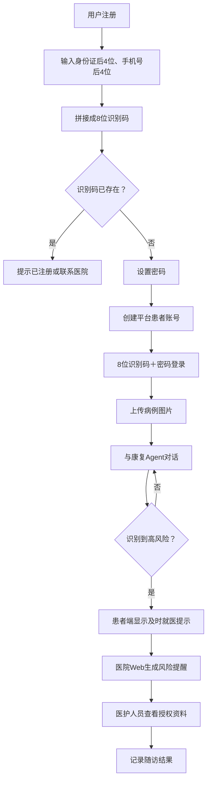
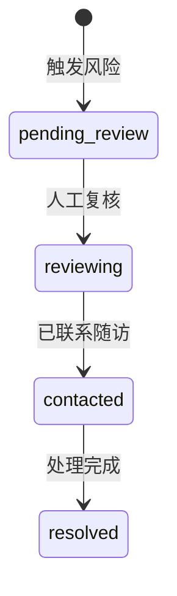

# 口腔智能体 · 康复随访系统 第一版方案说明（V1）

---

## 0. 核心定位（一句话）

用户通过**身份证后 4 位、手机号后 4 位 + 自设密码**创建**平台患者账号**（≠ 完成实名认证），系统自动生成 **8 位识别码**，用户凭「8 位识别码 + 密码」登录；可上传病例图片并与康复 Agent 对话；Agent 识别到高风险情况后，向医院 Web 端生成**风险提醒**，由医院人员**人工复核并随访**。

---

## 

|      |      |
| --- | --- |
|      |      |
|      |      |
|      |      |
|      |      |
|      |      |
|      |      |
|      |      |

---

## 2. 第一版业务流程



---

## 3. 注册流程

### 3.1 用户输入

- 身份证号后 4 位
- 手机号后 4 位
- 密码
- 确认密码
- 同意《隐私政策》和《医疗资料处理说明》

### 3.2 生成登录识别码

`login_code = 身份证后4位 + 手机号后4位`

示例：

| 项 | 值 |
| --- | --- |
| 身份证后 4 位 | 1237 |
| 手机号后 4 位 | 0001 |
| 登录识别码 | `12370001` |

> ⚠️ 必须按**字符串**处理，不能转换为数字，否则前导零会丢失。

### 3.3 注册接口

```
POST /api/auth/register
{
  "id_card_last4": "1237",
  "phone_last4": "0001",
  "password": "UserPassword123",
  "password_confirmation": "UserPassword123",
  "privacy_consent": true
}
```

### 3.4 后端处理步骤

1. 校验两个字段均为 4 位
2. 拼接 8 位 login_code
3. 查询 login_code 是否已存在
4. 校验密码与确认密码
5. 对密码做慢哈希
6. 创建患者平台账号
7. 返回注册成功

### 3.5 重复处理（第一版暂时规定）

| 情况 | 处理 |
| --- | --- |
| 识别码不存在 | 允许注册 |
| 识别码已存在 | 拒绝注册 |

对外提示：**"该信息已注册，如非本人操作请联系医院。"**

> 说明：该处理不能真正解决自然撞号，但可满足 Demo 流程；后续再改为顺序码、短信验证码或医院预登记方案。

---

## 4. 登录流程

```
POST /api/auth/login
{
  "login_code": "12370001",
  "password": "UserPassword123"
}
```

处理过程：

1. 校验 8 位识别码格式
2. 查询唯一平台账号
3. 检查账号状态
4. 验证 password_hash
5. 签发 JWT
6. 返回脱敏账号信息

登录失败**统一提示**（不能区分"账号不存在"与"密码错误"）：

```
{
  "code": "INVALID_CREDENTIALS",
  "message": "账号或密码错误"
}
```

---

## 5. 密码功能

第一版保留两种状态。

### 5.1 用户主动修改密码

流程：已登录 → 个人中心 → 修改密码 → 输入原密码 → 输入两次新密码 → 修改成功后重新登录。

```
POST /api/auth/change-password
Authorization: Bearer <JWT>
```

### 5.2 忘记密码

第一版不做自动找回，页面只显示：

> 如忘记密码，请联系医院工作人员协助处理。

医院 Web 端密码重置可暂不实现，先保留接口设计：

```
POST /api/admin/accounts/{account_id}/reset-password
```

后续可生成一次性临时密码。

---

## 6. 病例上传流程

```
POST /api/medical-files
Authorization: Bearer <JWT>
Content-Type: multipart/form-data
```

要求：

- 每个文件自动关联当前账户：`medical_file.account_id = JWT.sub`，**不能让前端任意传入其他人的 account_id**。
- 病例图片存放在**私有文件目录或私有对象存储**。
- 数据库只保存文件 ID、路径、上传者和时间。
- **不使用公开永久 URL**。
- 医院端查看时检查权限。
- 记录上传、查看、删除行为。
- Demo 使用**虚构病例图片**，不使用真实患者资料。

---

## 7. Agent 对话流程

```
创建 conversation → 发送 message → Agent 结合用户描述与授权病例信息生成回复
→ 风险检测模块评估消息 → 普通情况继续对话 / 高风险情况创建 risk_alert
```

**Agent 定位**：术后康复信息辅助与风险提示工具，**不代替医生诊断**。

> 不要表述为 Agent 直接诊断患者病情。

---

## 8. 危急情况处理

当用户触发高风险提醒后**同时执行两件事**：

### 8.1 患者端

> agent端提示就医

### 8.2 医院端

创建风险事件：

```
{
  "alert_id": "alert_uuid",
  "account_id": "account_uuid",
  "conversation_id": "conversation_uuid",
  "risk_level": "high",
  "trigger_summary": "患者情况描述",
  "status": "pending_review",
  "created_at": "2026-09-16T10:00:00Z"
}
```

> 风险提醒中**不直接附完整病例图片**，只提供受权限保护的查看入口。

---

## 9. 医院 Web 端流程

医院工作人员可以：

1. 查看风险提醒列表
2. 按未处理 / 处理中 / 已完成筛选
3. 打开平台患者账号
4. 查看用户授权上传的病例
5. 查看相关对话和触发原因
6. 记录随访结果、修改风险事件状态

风险状态流转：



> ⚠️ 本版医院锁定的是**触发风险提醒的平台患者账号**，不是已锁定真实医院患者身份。

---

## 10. 最小数据表设计

### patient_accounts（平台患者账号）

| 字段 | 说明 |
| --- | --- |
| id | 主键 |
| id_card_last4 | 身份证后 4 位 |
| phone_last4 | 手机号后 4 位 |
| login_code | 8 位识别码（**唯一索引**） |
| password_hash | 密码慢哈希 |
| status | 账号状态 |
| privacy_consent_at | 同意隐私政策时间 |
| created_at | 创建时间 |
| updated_at | 更新时间 |

### medical_files（病例文件）

| 字段 | 说明 |
| --- | --- |
| id | 主键 |
| account_id | 所属账号 |
| file_name | 文件名 |
| storage_key | 私有存储 key |
| mime_type | 文件类型 |
| file_size | 文件大小 |
| created_at | 上传时间 |

### conversations（对话）

`id` / `account_id` / `status` / `created_at` / `updated_at`

### messages（消息）

`id` / `conversation_id` / `sender_type` / `content` / `risk_level` / `created_at`

### risk_alerts（风险提醒）

`id` / `account_id` / `conversation_id` / `trigger_message_id` / `risk_level` / `trigger_summary` / `status` / `reviewed_by` / `reviewed_at` / `created_at`

### followup_records（随访记录）

`id` / `alert_id` / `staff_id` / `result` / `notes` / `created_at`

---

## 11. 第一版验收标准

### 11.1 注册登录

- [ ] 两组合法后 4 位可以创建账号
- [ ] 自动生成 8 位识别码
- [ ] 重复 8 位不能再次创建
- [ ] 密码不明文保存
- [ ] 正确账号密码可以登录
- [ ] 错误账号或密码不能登录
- [ ] JWT 过期后返回登录页

### 11.2 病例上传

- [ ] 用户只能上传到自己的账户
- [ ] 用户只能查看自己的文件
- [ ] 医院授权人员可以查看
- [ ] 未登录用户不能访问文件
- [ ] 文件 URL 不能永久公开

### 11.3 Agent 对话

- [ ] 用户能够连续对话
- [ ] 对话保存到当前账号
- [ ] 普通消息不产生提醒
- [ ] 测试风险消息可以产生高风险事件
- [ ] 患者端立即显示线下就医提示

### 11.4 医院 Web 端

- [ ] 能看到风险提醒
- [ ] 能打开对应平台账号
- [ ] 能查看该用户授权的病例和相关对话
- [ ] 能修改处理状态
- [ ] 能填写随访记录

---

## 12. 已知问题与暂不解决项（记录在案，避免后续无法调整）

1. 两个后 4 位无法验证用户信息真实性
2. 8 位识别码存在自然撞号
3. 密码只能认证账号控制者，不能证明其为患者本人
4. 医院没有预登记数据，无法完成真实患者绑定
5. 忘记密码需要人工处理
6. 病例图片仍然属于敏感医疗信息
7. 医院只能定位平台账号，不能保证对应院内真实患者
8. 正式系统需要补短信、一次性激活码或其他可信身份认证

---

## 13. 后续演进方向（备选，不在第一版实现）

- **注册**：顺序码 / 短信验证码 / 医院预登记，解决自然撞号
- **身份**：真实患者绑定与实名认证
- **密码**：忘记密码自动找回（一次性临时密码）、医院端重置落地
- **存储**：正式私有对象存储与更细粒度访问审计
